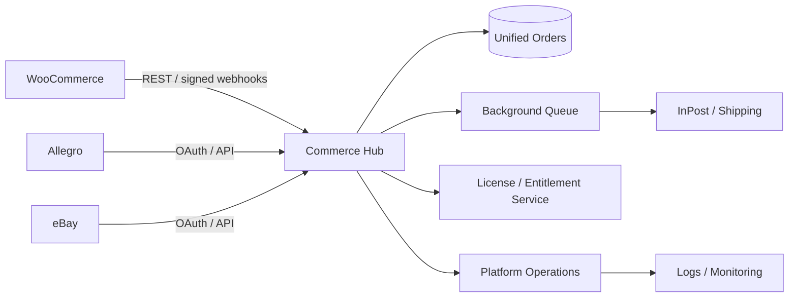
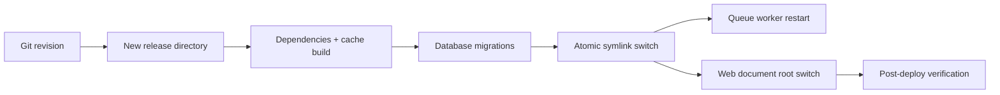
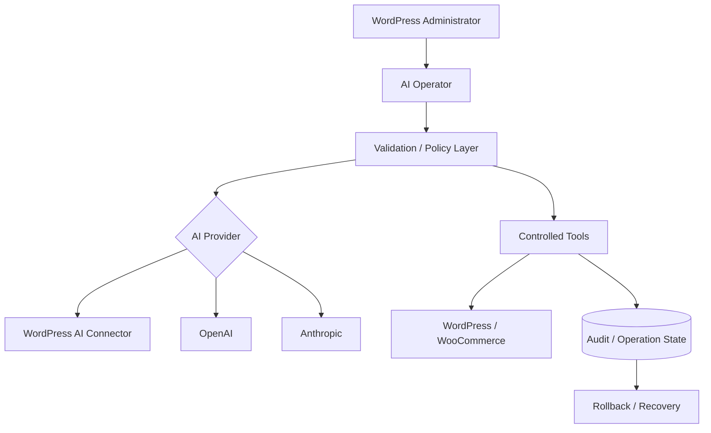
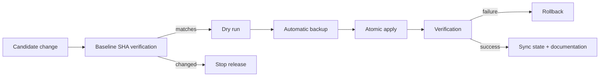
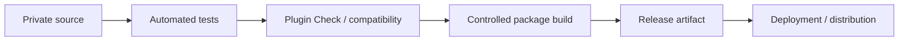
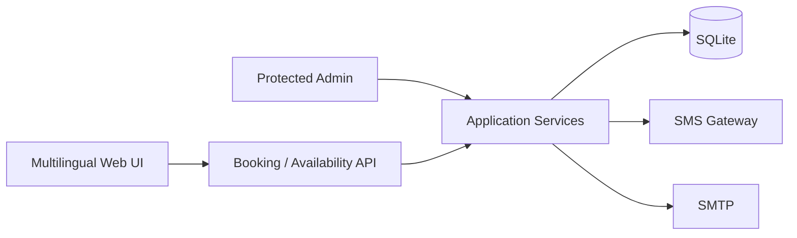
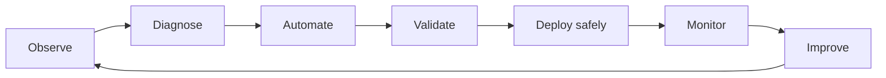

# Walentyn Weremejenko — Infrastructure, Automation & AI Portfolio

> Selected engineering work presented as architecture and outcomes.  
> Production source repositories remain private; this repository intentionally contains **no proprietary source code, credentials, customer data, or production configuration**.

**Focus:** OpenShift / Kubernetes · Linux / RHEL · Automation · Cloud · Observability · AI Infrastructure · Platform Engineering

I am a senior infrastructure engineer and systems administrator with 15+ years of Linux/infrastructure experience and hands-on work across OpenShift/OKD, Kubernetes, automation, monitoring, security, web platforms and AI-enabled systems.

My day-to-day engineering work includes operating high-availability environments, troubleshooting platform incidents, automating repeatable operations, designing monitoring and deployment workflows, and integrating infrastructure with business applications.

## Core stack

| Area | Technologies / practices |
|---|---|
| Containers & platforms | OpenShift / OKD 4.x, Kubernetes, Docker, Operators, RBAC, OAuth/IdP |
| Linux | RHEL, Rocky Linux, Debian, Ubuntu, systemd, LVM, patching, tuning, hardening |
| Automation | Ansible, Bash, Terraform, Git, GitOps / Argo CD |
| Observability | Prometheus, Grafana, alerting, Vector, Elasticsearch, log analysis |
| Networking & security | TCP/IP, DNS/BIND, HAProxy, Nginx, Apache, SSL/TLS, firewalls, Microsoft Entra ID / MFA |
| Cloud & virtualization | Microsoft Azure, VMware vSphere/ESXi, Proxmox, Hyper-V |
| Application platforms | Laravel, PHP, WordPress / WooCommerce, MariaDB, PostgreSQL, Redis |
| AI infrastructure | LLM integration, provider abstraction, containerized inference, AI-assisted operational tooling |

---

# Selected engineering projects

## 1. Multi-channel Commerce Hub

A private multi-tenant commerce platform designed to consolidate orders and fulfillment from **WooCommerce, Allegro and eBay**, with **InPost** shipment handling.

**Engineering highlights**
- Tenant isolation by company and role-based access.
- REST integrations and signed webhook processing.
- OAuth flows for marketplace integrations.
- Idempotent order synchronization.
- Shipment creation, labels and tracking.
- Queue-based background processing.
- Signed entitlement checks against a separate licensing service.
- Atomic release strategy for the Laravel application.
- Automated test suite: **150 tests** in the documented v1.7 state.

### Architecture

### Deployment approach

**What this demonstrates:** application-platform operations, integration engineering, authentication flows, deployment safety, multi-tenancy, queues and production troubleshooting.

---

## 2. AI Operator & Plugin Platform

An engineering project around an AI-enabled WordPress operations layer and a wider plugin/licensing ecosystem.

The private implementation includes an AI operator capable of working through multiple provider modes and controlled operational actions, with emphasis on validation, auditability and rollback rather than unrestricted autonomous modification.

**Engineering highlights**
- AI provider abstraction.
- Integration paths for OpenAI / Anthropic and WordPress AI connectors.
- Controlled tool execution.
- Audit-oriented workflow and rollback-aware operations.
- Internationalization (EN/PL).
- WordPress Plugin Check validation.
- Documented state of the AI Operator: **336 PHPUnit tests + 8 Node tests**.
- Supporting licensing / entitlement architecture and update workflows.

### Conceptual architecture

**What this demonstrates:** AI integration, provider abstraction, safe automation, testing discipline and operational thinking.

---

## 3. Production Web Infrastructure & Safe Deployment Automation

A private production repository used to manage a web platform together with deployment tooling and operational documentation.

Instead of editing production files manually, changes follow a guarded release workflow with baseline verification, dry-run, backup and rollback.

### Release safety model

**Practices demonstrated**
- Deployment guards against unexpected production drift.
- Automatic pre-change backup.
- Explicit rollback path.
- Atomic writes / controlled release procedure.
- Production-state synchronization back to version control.
- Operational documentation kept with engineering changes.
- SEO/sitemap release checks integrated into the deployment process.

**What this demonstrates:** Linux operations, Bash/Python automation, production change control, rollback design and reliability engineering.

---

## 4. WordPress / WooCommerce Plugin Engineering

A private suite of WordPress/WooCommerce plugins covering diagnostics, URL management, search, SEO assistance, translation, marketplace connectivity and AI-assisted operations.

At the documented verification point:
- six release candidates passed WordPress Plugin Check with **0 errors**;
- individual plugins include automated PHPUnit coverage;
- the AI Operator component reached **336 PHPUnit tests**;
- packaging scripts build distributable artifacts while excluding development-only files;
- localization is handled with English source strings and Polish translations.

### Delivery model

**What this demonstrates:** release engineering, automated validation, compatibility work, packaging and application security awareness.

---

## 5. Multilingual Booking Platform

A lightweight booking system built around PHP 8.x and SQLite with a deliberately small dependency footprint.

**Selected characteristics**
- Real-time availability and booking.
- Separate administrative interface.
- RU / EN / KA public localization.
- SMS and SMTP notification paths.
- CSRF protection and login rate limiting.
- Application data and configuration kept outside the public document root.
- Image validation/re-encoding for uploaded portfolio content.
- Database constraint preventing double booking.

### High-level architecture

**What this demonstrates:** secure-by-default web architecture, operational simplicity and end-to-end delivery.

---

## 6. Mobile Narrative Application — Equinox Stories

A private Android narrative-game project used as an additional example of shipping and validation outside my core infrastructure work.

The documented test build contains two interactive stories, local progress, multilingual UI, character/outfit systems, audio and a large set of automated scenario/layout checks.

**Documented validation includes**
- APK v2/v3 signing checks;
- ZIP alignment verification;
- byte-level asset verification;
- hundreds of engine transition checks;
- thousands of story-path test executions;
- layout variants and multilingual scenario tests.

This project is included to demonstrate breadth, build/release discipline and the use of automation beyond server infrastructure.

---

# How I approach infrastructure work

My preference is to turn recurring operational knowledge into repeatable automation: documented procedures, checks, monitoring, guarded deployments and recovery paths.

## Current professional direction

I am particularly interested in senior roles involving:

- OpenShift / Kubernetes platform operations
- Linux / RHEL infrastructure
- Platform engineering
- Infrastructure automation
- Observability and reliability
- Azure / hybrid infrastructure
- AI infrastructure and AI-assisted operations

## Source-code policy

The systems described here include commercial and production work. Their full source repositories are intentionally private.

This showcase exposes architecture, engineering decisions, technology choices and verified project outcomes without publishing proprietary implementation details, credentials or customer information.

---

**Walentyn Weremejenko**  
Senior OpenShift / Kubernetes & Linux Infrastructure Engineer  
Szczecin, Poland · Remote
