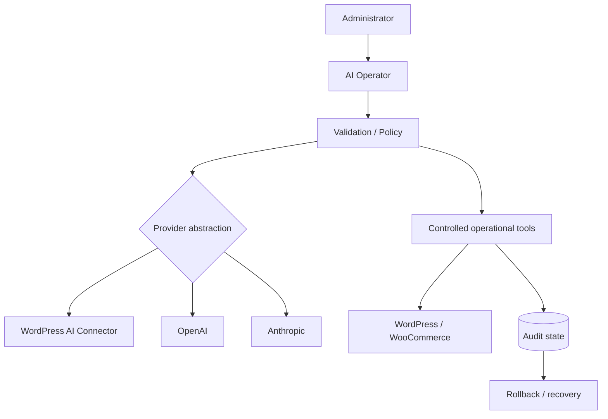

# AI Operator & Plugin Platform

## Goal
Build an AI-assisted operational layer for WordPress/WooCommerce where AI actions remain controlled, testable and auditable.

## Private implementation
Source code and commercial implementation details remain private.

## Architecture

## Engineering themes
- provider abstraction instead of hard-coding one AI backend
- controlled tool execution
- rollback-aware operations
- auditability
- localization
- automated tests and compatibility validation
- licensing / entitlement integration

## Verification
The documented AI Operator state reached 336 PHPUnit tests and 8 Node tests. The wider plugin release work also uses WordPress Plugin Check and packaging validation.

## Skills demonstrated
AI integration · automation · PHP · WordPress · WooCommerce · API design · testing · secure operations · release engineering
