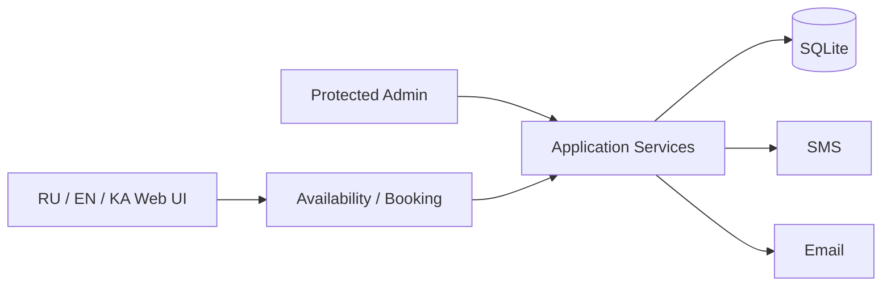

# Multilingual Booking Platform

## Goal
Deliver a small operationally simple booking application with strong separation between public content, application state and secrets.

## Architecture

## Selected engineering decisions
- PHP 8.x with a deliberately small dependency footprint
- SQLite-backed booking state
- database-level protection against double booking
- CSRF protection
- login rate limiting
- configuration and data outside the public document root
- validated image uploads with server-side re-encoding
- SMS and authenticated SMTP notification paths
- multilingual public interface

## Skills demonstrated
PHP · SQLite · security · web operations · SMTP · API integration · localization · deployment design
