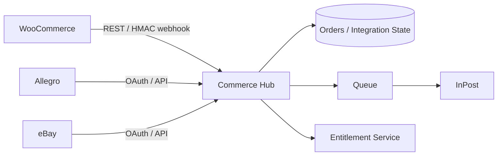

# Multi-channel Commerce Hub

## Goal
Create a single operational layer for orders and fulfillment across multiple commerce channels while preserving tenant isolation and safe integration boundaries.

## Private implementation
The production source remains private. This document describes architecture and engineering outcomes only.

## Scope
- WooCommerce REST integration and signed webhooks
- Allegro and eBay OAuth/API integration paths
- unified order model
- InPost shipment, label and tracking workflow
- company-level tenant isolation and role-based access
- background queue processing
- signed license/entitlement checks
- atomic Laravel release workflow

## Architecture

## Reliability and security decisions
- Synchronization is designed to be idempotent.
- Integration credentials are configuration/secrets, not showcase content.
- Tenant data is isolated by company context.
- Marketplace tokens are refreshable OAuth state.
- Releases are versioned and switched atomically.
- Production validation follows deployment rather than assuming a successful command means a successful release.

## Verification
The documented v1.7 state includes 150 automated tests.

## Skills demonstrated
Laravel · PHP · APIs · OAuth · HMAC · queues · multi-tenancy · deployment automation · Linux operations · integration troubleshooting
