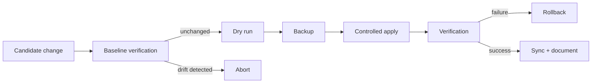

# Production Deployment & Operations Automation

## Goal
Replace ad-hoc production edits with a guarded, repeatable deployment process.

## Workflow

## Engineering principles
- detect production drift before applying changes
- create a recoverable state before modification
- make rollback explicit
- verify the actual served state after deployment
- keep operational documentation with version-controlled changes
- automate repetitive checks instead of relying on memory

## Technologies
Linux · Bash · Python · Git · Apache/Nginx · Plesk · DNS · TLS · deployment scripting · monitoring

## Skills demonstrated
production operations · change safety · troubleshooting · scripting · recovery design · documentation
